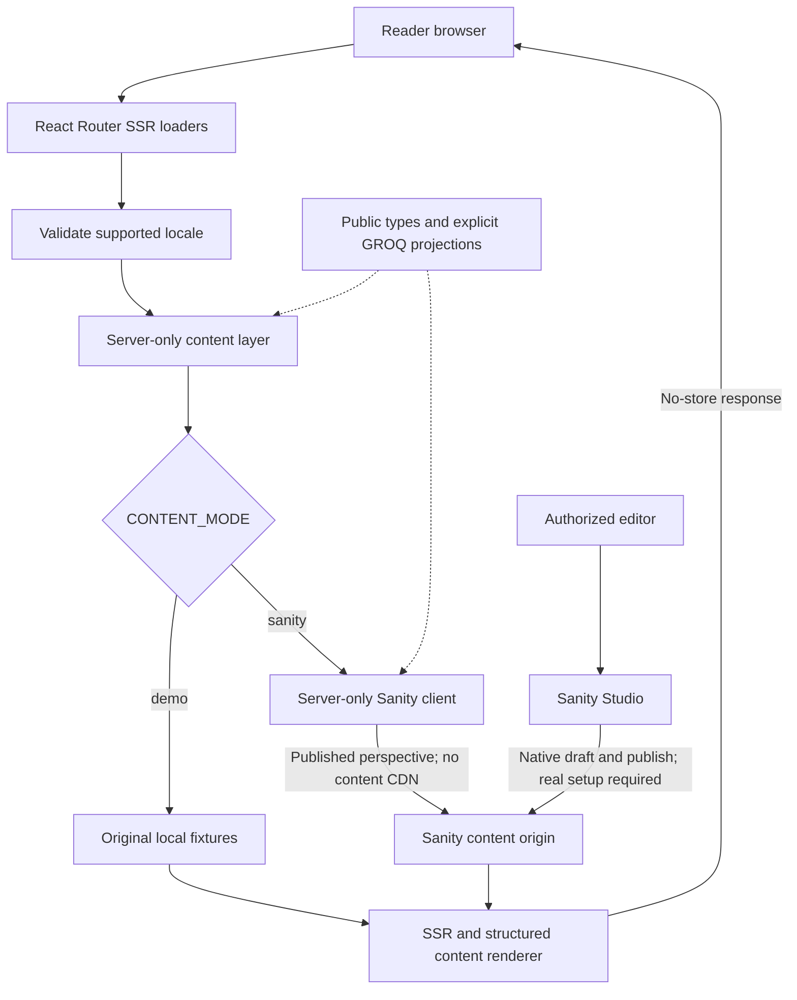

# Architecture

[Overview](../README.md) · [Content model](content-model.md) · [Deployment](deployment.md) · [Search](search.md) · [Helpfulness](helpfulness.md)

## Workspace and boundaries

The pnpm 10.33.0 monorepo contains three workspaces:

| Workspace | Responsibility |
| --- | --- |
| `apps/web` (`@mw/web`) | React 19.3 / React Router 7.18.4 framework SSR, Vite 7.3.6, English/Japanese UI and locale-filtered public content delivery |
| `apps/studio` (`@mw/studio`) | Sanity 6.16 schema and native Studio editing interface |
| `packages/content` (`@mw/content`) | Handwritten public TypeScript result types, explicit GROQ projections, and original demo fixtures |

TypeScript is 5.9.3. Workspace `useNodeVersion` and `nodeVersion` both pin Node 22.23.3, allowing pnpm-managed project-local execution without replacing system Node. React Router route type generation is separate from Sanity TypeGen: the content contract is **not generated**.

## Source tree

This is a source-oriented tree; installed dependencies and generated artifacts are omitted. Runtime `.env` files are ignored; their example files are versionable templates.

```text
MW-Helpcenter/
├── README.md
├── .env.example                 # directs configuration to each app
├── .gitignore
├── .npmrc                       # exact saves, strict engines
├── .nvmrc                       # 22.23.3
├── .prettierignore
├── .prettierrc.json
├── package.json                 # workspace orchestration commands
├── pnpm-lock.yaml
├── pnpm-workspace.yaml          # apps/*, packages/*, Node pins
├── eslint.config.js
├── vitest.config.ts
├── apps/
│   ├── web/
│   │   ├── .env.example
│   │   ├── package.json
│   │   ├── react-router.config.ts
│   │   ├── vite.config.ts
│   │   ├── tsconfig.json
│   │   └── app/
│   │       ├── root.tsx         # document, i18n provider, headers, errors
│   │       ├── routes.ts        # explicit framework route configuration
│   │       ├── components/
│   │       │   ├── content/rich-content.tsx
│   │       │   ├── layout/site-shell.tsx
│   │       │   └── ui/
│   │       │       ├── article-helpfulness.tsx
│   │       │       ├── article-list.tsx
│   │       │       ├── language-switcher.tsx
│   │       │       ├── loading-feedback.tsx
│   │       │       ├── search-form.tsx
│   │       │       ├── share-guide.tsx
│   │       │       ├── spinner.tsx
│   │       │       └── toaster.tsx
│   │       ├── features/
│   │       │   ├── helpfulness.ts
│   │       │   └── search/{rank.ts,text.ts,highlight.tsx}
│   │       ├── i18n/
│   │       │   ├── config.ts
│   │       │   ├── instance.ts
│   │       │   └── locales/{en,ja}/  # each contains these four bundles
│   │       │       ├── common.json
│   │       │       ├── navigation.json
│   │       │       ├── search.json
│   │       │       └── feedback.json
│   │       ├── lib/
│   │       │   ├── content.server.ts
│   │       │   ├── env.server.ts
│   │       │   ├── helpfulness.server.ts
│   │       │   ├── helpfulness-store.server.ts
│   │       │   ├── switch-language.server.ts
│   │       │   ├── sanity/client.server.ts
│   │       │   └── security/urls.ts
│   │       ├── routes/
│   │       │   ├── redirect.ts
│   │       │   ├── locale.tsx
│   │       │   ├── language-switch.ts
│   │       │   ├── home.tsx
│   │       │   ├── product.tsx
│   │       │   ├── collection.tsx
│   │       │   ├── article.tsx
│   │       │   ├── search.tsx
│   │       │   ├── support.tsx
│   │       │   ├── not-found.tsx
│   │       │   └── resources/
│   │       │       ├── robots.ts
│   │       │       └── sitemap.ts
│   │       └── styles/
│   │           ├── tokens.css
│   │           ├── components.css
│   │           ├── globals.css
│   │           ├── motion.css
│   │           └── feedback.css     # imported last, after motion
│   └── studio/
│       ├── README.md
│       ├── .env.example
│       ├── .gitignore
│       ├── package.json
│       ├── sanity.cli.ts
│       ├── sanity.config.ts
│       ├── tsconfig.json
│       └── schemas/
│           ├── common.ts
│           ├── documents.ts
│           ├── richContent.ts
│           └── index.ts
├── packages/content/
│   ├── README.md
│   ├── package.json
│   ├── tsconfig.json
│   ├── src/
│   │   ├── index.ts
│   │   ├── types.ts
│   │   ├── queries.ts
│   │   ├── fixtures.ts
│   │   └── fixtures.ja.ts
│   └── tests/query-contract.test.ts
└── docs/
    ├── architecture.md
    ├── design-system.md
    ├── localization.md
    ├── content-model.md
    ├── editorial-workflow.md
    ├── deployment.md
    ├── search.md
    ├── helpfulness.md
    └── migration.md
```

## Request and editing flow



The Sanity branch describes the implemented integration path, not an already provisioned or authenticated service. The client uses `perspective: 'published'`, `useCdn: false`, and an optional server-only read token. Queries filter language and exclude `drafts.**` and `versions.**`; nested output fields are explicitly selected.

`getCatalog` reads products, collections, and article summaries in parallel. Product and collection loaders find matching slugs and filter summaries in memory; they do not currently use the exported singular product/collection queries. The article loader fetches the full article and catalog for collection context and up to three related guides sharing products.

Live reads go to the origin per request. Root HTML responses and crawler resources set `Cache-Control: no-store`; no application content cache, webhook invalidation, or hosted search index is configured. Subsequent origin reads therefore do not depend on a webhook to reflect unpublishing. This is not push refresh of an already open browser page. Images may still be delivered from Sanity's asset CDN; that is distinct from caching content queries.

## Routes

| Path | Behavior |
| --- | --- |
| `/` | 302 redirect to `/en` |
| `/language?to=...&from=...` | Validated GET language switch; redirect to a resolved local destination |
| `/:locale` | Home and product discovery |
| `/:locale/products/:slug` | Product guide list and product-specific collections |
| `/:locale/collections/:slug` | Collection guide list |
| `/:locale/articles/:slug` | GET: structured article, related guides and visitor's helpfulness state; POST: helpfulness submission |
| `/:locale/search?q=...&product=...` | Title/summary/visible-body search, optional product slug filter |
| `/:locale/support` | Approved email link if configured; otherwise a pending-configuration message |
| `/robots.txt` | Demo disallow-all; Sanity mode allows crawling except search |
| `/sitemap.xml` | Empty in demo; locale home/product/collection/article URLs in Sanity mode |

Both `en` and `ja` are supported. Unsupported locale routes and missing content return 404; Sanity failures do not produce demo content. The CMS `redirect` document is not consumed by a redirect resolver. `routes/redirect.ts` implements only the root-to-English redirect; `routes/language-switch.ts` handles language switching separately.

The shared header and error pages use a native language select: JavaScript submits on change, while a `noscript` button supports a full GET navigation. The URL selects language, without a cookie. `switch-language.server.ts` validates local destinations and resolves articles through a unique published `translationGroupId` counterpart with its own slug, dropping article hashes. Products/collections use stable shared slugs only when present in the target catalog. Missing translations redirect to the target home with `?translation=unavailable`, not English content. Search retains the query (capped at 200 characters, not translated) and only a valid target-language product filter; home switching preserves `#products`. See [localization](localization.md) for content and publication rules.

## Client feedback boundaries

`root.tsx` imports tokens, components, globals, motion, then **feedback.css last**.
The feedback palette and surfaces are locally adapted from `tiktok-qc-tool/public/css/mw-components.css`; that project is not a runtime dependency. `spinner.tsx` supplies a shared decorative ring (`sm` 18px, `md` 24px, `lg` 32px), while `loading-feedback.tsx` supplies the navigation chip and results skeleton.

`SiteShell` uses real React Router pending state for a nonblocking fixed bottom chip and the retained top progress bar, with a CSS-only 120ms reveal delay. Its live status is outside the busy main; decorative indicators do not duplicate it. On the search page, only pending navigation to the same locale's search pathname hides stale results/count and shows the skeleton. The filter button reserves a stable spinner slot; the search submit ring replaces its arrow for its own GET submission. During `/language` submission the ring replaces the globe without disabling the native select. Reduced motion keeps static feedback without reveal delays, rotation or shimmer.

Initial SSR is server-blocking: loaders finish before their content renders, with no initial loading skeleton. There are no fake request delays, minimum loading durations, or general navigation modals.

Articles mount `ShareGuide`, keyed by article ID. Its native `.js-only` button is hidden without JavaScript and opens an `@radix-ui/react-dialog` modal with focus trapping, Escape/overlay dismissal, scroll locking and focus restoration. On opening, the readonly link uses current origin plus pathname, dropping query/hash. Clipboard writes run only on Copy activation; a busy guard rejects duplicates and stale completions are ignored after close or unmount. Successful copying closes the dialog before emitting a Sonner success toast with ID `guide-copy`; failure leaves an inline alert and selectable link for manual copy or retry, never a fake success.

The root mounts `FeedbackToaster` inside the i18n provider. Sonner manages top-right stacking (maximum three visible), 6-second notifications, close controls and hover/focus pausing; language changes dismiss notifications. Sharing performs no analytics, storage or network submission. These sharing/loading responses are transient; article helpfulness persists separately as described below. Generic error pages expose a localized full-reload retry link for pathname plus query; 404 pages do not offer retry. See [design system](design-system.md) for presentation and accessibility contracts.

## Local article helpfulness

`article.tsx` reads safe visitor-specific state and delegates POSTs to `helpfulness.server.ts`; `ArticleHelpfulness` supports fetcher and no-JavaScript document submissions. The server validates origin, bounded form data and the published article resolved from locale/slug before saving. `helpfulness-store.server.ts` uses synchronous native `node:sqlite` on pinned Node **22.23.3**, WAL and per-operation connections. Storage failures hide the form on reads or return a safe submission error without making article content depend on feedback availability.

Votes upsert by `(source, article_id, locale, visitor_hash)`, not translation group or slug. Only the visitor identifier is SHA-256 hashed; article IDs and enum values are stored directly. A random 30-day `HttpOnly; SameSite=Lax` cookie is issued only after a successful vote without a valid existing token (`Secure` for HTTPS requests). Reads and updates with a valid cookie do not renew it. This is best-effort browser deduplication, not authenticated identity.

Demo defaults to `data/helpfulness-demo.sqlite` relative to cwd (`apps/web/data/helpfulness-demo.sqlite` under root pnpm web commands); Sanity requires explicit `FEEDBACK_DB_PATH`. Use dedicated PRIVATE local persistent storage only. Opening the store, including on reads, chmods its immediate parent to `0700` even if it exists. It does not validate safe hosting placement or secure the whole ancestor path. Votes expire from reads after 90 days; row purging occurs only during subsequent write attempts, not on a timer. Transactional rolling limits are 10 accepted writes per visitor and 100 globally per minute per database, not upstream request protection. See [helpfulness](helpfulness.md) for filesystem, retention, backup and abuse caveats. No public report/dashboard or Sanity feedback write is implemented.

## Search and localization limits

The search loader uses a separate `getSearchCatalog` / `SEARCH_ARTICLES_QUERY` for searchable queries, leaving ordinary catalogs summary-only. It projects supported visible body text (spans, callouts, procedures, tables and image captions), not annotation URLs, assets, alt text, keys or SEO. `searchArticles` returns whitelisted summaries plus optional snippets, highlight terms and typo flags, never raw bodies. The compatibility helper `rankArticles` remains summary-only.

Every distinct term must match after locale/product filtering and draft/version exclusion. Exact-only results precede typo results; fewer corrections rank first, then title/summary/body relevance and locale-aware title order. English folds case, width and diacritics with bounded one-edit matching for eligible ASCII words; Japanese uses NFKC, preserves dakuten, segments words and has no typo matching. Raw queries over 200 UTF-16 units are rejected. Blank, oversized and Japanese punctuation-only queries skip the body catalog. Snippets are at most 240 UTF-16 units, preserve original graphemes and render as React text with `<mark>` highlights. See [search](search.md) for exact limits and offline verification.

There is no semantic retrieval, hosted index, pagination or automatic query translation. Search scans the fetched locale catalog in memory; higher traffic and larger bodies require capacity review. Further languages require their own normalization, segmentation and collation review.

i18next 26 / react-i18next 17 instances are created per request/render tree, not mutated as a server singleton. Four bundled namespaces (`common`, `navigation`, `search`, `feedback`) in both English and Japanese support SSR and hydration. UI resource fallback does not substitute English CMS documents. Real Japanese publication still requires human-reviewed CMS content; demo fixtures are illustrative only. See [localization](localization.md).

## Future architecture work

Draft preview, signed webhooks, content caching, production feedback operations/reporting, hosted search, migration tooling, languages beyond English/Japanese, and in-product help are not configured. Higher traffic or a larger catalog will require a deliberate caching/indexing design; introduce signed webhook handling, unpublish/delete invalidation, and recovery checks alongside that cache rather than assuming freshness is automatic. Studio scheduling is plan-dependent; approvals are not enforced by the current schema or UI.